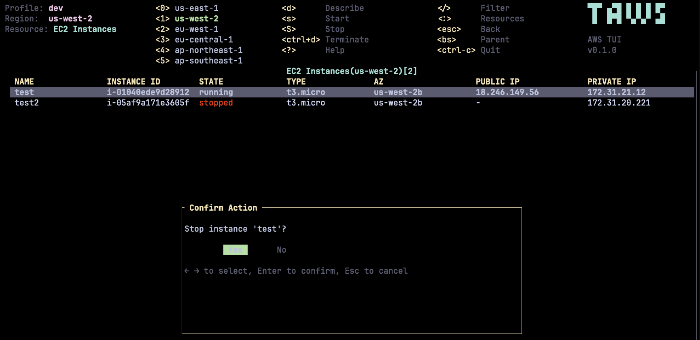

# upstash-tui
---
layout: cover
subtitle: Your Upstash resources, without leaving the terminal
author: Upstash
date: 2026
---

A terminal-native console — powered by Bun + OpenTUI.

# The Problem
---
layout: statement
---

Developers live in the terminal.

The web console is a context switch — new tab, click through menus, lose your flow.

# Inspired by taws
---
layout: center
subtitle: A terminal UI for AWS · 2.2k stars · Rust · Vim-style
---

{width=90 height=22 fit=contain caption="huseyinbabal/taws — resource list + confirm-before-action"}

# Meet upstash-tui
---
layout: section
subtitle: A full TUI for managing Upstash — built on Bun + OpenTUI React
---

Redis, QStash, Workflow, and Vector — usage and actions, all keyboard-driven.

# The Dashboard
---
layout: two-cols
subtitle: Everything keyboard-driven
---

Resource list

- databases at a glance
- per-DB sparklines   ▁▂▃▄▅▆▇█
- live traffic shape

::right::

Details panel

- usage-vs-limit bars
- commands · storage · cost
- select and act — no mouse

# Cost And Limits
---
layout: default
subtitle: Notice limits before billing does
---

Usage bars ramp with pressure:  ▓▓▓▓▓▓▓░░  green → amber → red

- budgets tracked per database
- contextual Prod Pack / Enterprise nudges

:::tip Stay ahead
See you're near a limit without ever opening the billing page.
:::

# One Console, Every Product
---
layout: default
subtitle: One binary · tab between products · one keyboard model
---

- Redis · QStash · Workflow · Vector — all live
- Tab between products; the same keys work everywhere
- Live metric cards per product; write actions on Redis & QStash

# The AI Command Bar
---
layout: section
subtitle: Type what you want. Confirm what runs.
---

The headline feature — and its whole point is what it *won't* do.

# From English to a Plan
---
layout: statement
---

"Rename this database to prod-cache and set a $50 budget."

→ becomes an operation plan you preview and confirm. Nothing runs unprompted.

# Credential-Free
---
layout: default
subtitle: Safeguard 1 · the model never touches your secrets
---

The LLM only emits a JSON plan. It never sees — and never needs — your credentials.

:::tip Credentials stay local
Auth happens on your machine, after you confirm. The planner works blind.
:::

# Strict Allowlist
---
layout: code
subtitle: Safeguard 2 · the model can't invent operations
---

```ts [src/operations/validate.ts] {1-7,10} lines title="Every plan is validated"
const OP_TYPES = [
  "redis.create",
  "redis.rename",
  "redis.toggleEviction",
  "redis.updateBudget",
  "redis.delete",
] as const

// LLM output is checked against this fixed list — nothing else runs
if (!OP_TYPES.includes(type)) fail(`unknown op type: ${type}`)
```

Anything outside this list is rejected before it can execute.

# The AI Cannot Delete
---
layout: default
subtitle: Safeguard 3 · destructive power stays in human hands
---

Deleting a database is a real operation — tagged `destructive`, "cannot be undone."
The planner is told never to generate one — and if the model tries anyway, the code refuses it.

| Risk | Example | Confirm |
| --- | --- | --- |
| safe | rename · set budget | yes |
| paid | create database | yes |
| destructive | delete database | yes — human-only |

:::warning The model can't reach the sharp edge
Delete happens only through a deliberate human action, never from a prompt.
:::

# Roadmap
---
layout: default
subtitle: Live today — and what's next
---

| Product | Status | In the terminal |
| --- | --- | --- |
| Redis | live | databases · usage · AI command bar |
| QStash | live | schedules · topics · DLQ · publish |
| Workflow | live | runs & status |
| Vector | live | indexes · limits · metrics |
| Box | soon | instant dev sandboxes |

# upstash-tui
---
layout: quote
---

Build the console the way developers already work.
